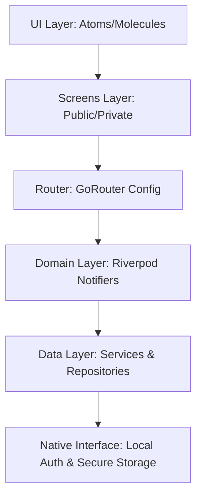

# 🛡️ Face ID Pro: Advanced Biometric Ecosystem

[](https://flutter.dev)
[](https://dart.dev)
[](https://blog.cleancoder.com/uncle-bob/2012/08/13/the-clean-architecture.html)
[](https://opensource.org/licenses/MIT)

A high-performance, ultra-secure Flutter application demonstrating **State-of-the-Art** Face ID and biometric authentication flows. This repository isn't just a project; it's a blueprint for **Enterprise-Grade** mobile development using a decentralized **Agentic Expert Ecosystem**.

---

## 🏗 High-Level Architecture

Our project follows a strict **Domain-Driven Design (DDD)** inspired approach, localized for Flutter's reactive nature.



---

## 🧠 Agentic Expert Ecosystem

This repository is governed by **10 Specialized AI Agents**. Each agent enforces strict architectural, security, and performance rules defined in `.agents/skills/`.

| Expert | Core Objective |
| :--- | :--- |
| **Architect Pro** | Modular routing and directory orchestration. |
| **Biometrics Expert** | Hardware lifecycle and fail-safe authentication. |
| **Security Architect** | Vault-level persistence and encryption. |
| **UI/UX Specialist** | Premium aesthetic (Obsidian/Glass theme). |
| **Riverpod Expert** | Functional reactive state management. |
| **Performance Pro** | 120 FPS target and memory leakage prevention. |
| **Testing Expert** | Regression-proof code via Piramidal Testing. |
| **Clean Code Expert** | SOLID, DRY, and KISS enforcement. |
| **Platform Configurator** | Native bridge (Swift/Kotlin) and permissions. |
| **Commits Expert** | Semantic and actionable Git history. |

---

## 🛠 Prerequisites

Before you begin, ensure you have the following installed:
- **Flutter SDK**: `^3.11.1` ([Install Guide](https://docs.flutter.dev/get-started/install))
- **Git**: Latest version
- **CocoaPods** (for iOS/macOS): Latest version
- **Android Studio / Xcode**: For native emulators and build tools.

---

## 🚀 Getting Started

Follow these steps to get your development environment running perfectly:

### 1. Clone the Repository
```bash
git clone https://github.com/DiegoVilla27/face-id-flutter.git
cd face-id-flutter
```

### 2. Install Project Dependencies
```bash
flutter pub get
```

### 3. Initialize Native Configurations (iOS only)
```bash
cd ios
pod install
cd ..
```

### 4. Generate Localizations (l10n)
Our project uses explicit localization generation:
```bash
flutter gen-l10n
```

### 5. Start the State-Engine Generator
Riverpod annotations require code generation. Run this in a separate terminal:
```bash
dart run build_runner build --delete-conflicting-outputs
```
> [!TIP]
> Use `dart run build_runner watch` during development to auto-generate files on save.

### 6. Run the Application
```bash
flutter run
```

---

## 📁 Project Structure (Modular Layout)

```text
lib/
├── core/
│   ├── extensions/    # BuildContext helpers (l10n, theme, ds)
│   └── router/        # GoRouter modular definitions (config, names)
├── l10n/              # ARB files & Generated output
├── screens/
│   ├── private/       # Auth-guarded screens (Home)
│   └── public/        # Open-access screens (Login)
├── services/          # Business logic & Riverpod Providers
└── ui/
    └── atoms/         # Design Tokens (Colors, Spacers, Typography)
```

---

## ✅ Core Features Implemented

- [x] **Modular Navigation**: GoRouter with automatic Auth-Redirection.
- [x] **Reactive State**: Functional Riverpod with Annotations.
- [x] **Premium Design System**: Obsidian Dark Mode with Atomic Design.
- [x] **Semantic Git**: 100% adherence to Conventional Commits.
- [x] **Agentic Guardrails**: 10 skill-based expert configurations.

---

## ⚠️ Troubleshooting

- **"l10n package and imports not found"**: Ensure you run `flutter gen-l10n`.
- **"g.dart files missing"**: Run `dart run build_runner build`.
- **"CocoaPods could not find compatible versions"**: Run `cd ios && rm -rf Pods Podfile.lock && pod install`.

---

## 📄 License

Distributed under the **MIT License**. See `LICENSE` for more information.

---
*Developed with the precision of AI and the passion of Human Engineering.*
